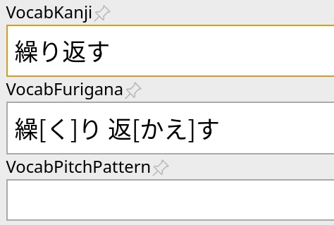

# AJT Pitch Accent

[](https://ankiweb.net/shared/info/1225470483)
[](https://tatsumoto-ren.github.io/blog/join-our-community.html)
[](https://t.me/ajatt_tools)
[](https://www.patreon.com/bePatron?u=43555128)


This add-on allows you to look up Japanese pitch accents of a particular expression.
For this to work, you have to add fields named `VocabKanji` and `VocabPitchPattern` to your notes.
The lookups will be performed on the `VocabKanji` field,
and the accents will be added to the `VocabPitchPattern` field.
To generate pitch accents, focus the `VocabKanji` field and press "Tab" or switch focus away from the field.



You can change both of these field names or add more source fields in the config.

## Installation

Install from [AnkiWeb](https://ankiweb.net/shared/info/1225470483),
or manually with `git`:

```
git clone 'https://github.com/Ajatt-Tools/PitchAccent.git' ~/.local/share/Anki2/addons21/pitch_accent
```

## Configuration

To configure the add-on select "AJT" > "Pitch Accent Options...".

To edit the config file, open the Anki Add-on Menu
via "Tools" > "Add-ons" and select "AJT Pitch Accent".
Then click the "Config" button on the right-side of the screen.

## Usage

When adding cards with Yomichan, the pronunciation is automatically looked-up and added to the cards.
When adding cards manually, fill the `VocabKanji` field and press "Tab" to trigger generation.

There's a context menu item.
Select the expression you would like to look up,
then right-click and choose "NHK pitch accent lookup".
Alternatively, go ot "Tools" > "NHK pitch accent lookup".

When using the Anki Browser, you can mass-generate pitch accents in bulk.
To do this, select several notes first,
and then choose "Edit" > "Bulk-add pitch accents".
By default, the "bulk-add" feature will not overwrite the `VocabPitchPattern` field if its already filled,
but you can change this by setting `regenerate_readings` to `True` in the config.

If the add-on can't find any pitch accent data for the word spelled in kanji,
it tries searching using the kana reading of the word.
This behavior can be toggled off in settings.

If the add-on detects furigana reading in the source field,
it will add pitch accents for the specified reading and skip other readings
if they're present in the pitch accent database.

## Pitch accent, what is that?

For more information on the Japanese pitch accent,
I would like to refer you to http://en.wikipedia.org/wiki/Japanese_pitch_accent.

In short, the following notations can be found:

* **Overline:** Indicates "High" pitch (see "Binary pitch" in Wikipedia article).
* **Downfall arrow:** usually means stressing the mora/syllable before.
* **Red circle mark:** Nasal pronunciation、e.g. `げ` would be a nasal `け`.
* **Blue color:** barely pronounced at all.

For example, a blue `ヒ` would be closer to `h` than `hi`.
Likewise, a blue `ク` would be more like a `k` than `ku`.

I can't speak for someone else, but for me,
just knowing about the pitch accent and how it might affect the meaning
has helped me a great deal.
There are some tricky words like はし and じどう,
where different pronunciations have wildly varying meanings.
Aside from that, knowing about these rules might help you
avoid speaking with a distinct foreign accent.

## Pitch accent data

This add-on uses two databases to generate pronunciations from:

1) NHK data from `NHK日本語発音アクセント辞典`.
2) Kanjium data. The repository can be found
[here](https://github.com/mifunetoshiro/kanjium/).

The two databases produce 229798 entries total.

## Acknowledgements

This add-on is a completely remastered version of
[Japanese Pronunciation / Pitch Accent](https://ankiweb.net/shared/info/932119536).

The changes include:

* Significantly refactored 99% of the codebase.
* Removed all annoying features.
* Preset the default config file to match
the [mpvacious cards](https://ankiweb.net/shared/info/1557722832)
note type.
If you're using mpvacious cards, you don't have to configure the add-on before using it.
* Added kana lookups.
* Fixed a great number of bugs.
* Bundled [Mecab controller](https://github.com/Ajatt-Tools/mecab_controller) with the add-on.
