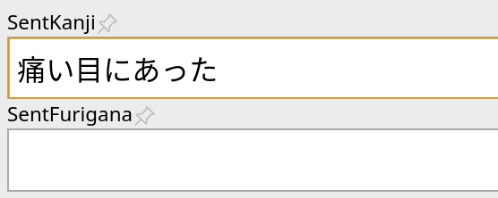

# AJT Japanese

[](https://ankiweb.net/shared/info/1344485230)
[](https://tatsumoto-ren.github.io/blog/join-our-community.html)
[](https://t.me/ajatt_tools)
[](https://tatsumoto.neocities.org/blog/donating-to-tatsumoto.html)


The purpose of this add-on is to automatically generate and bulk-generate furigana readings.
To do its job, the add-on relies on
[mecab_controller](https://github.com/Ajatt-Tools/mecab_controller).
Additionally, the add-on allows you to look up Japanese pitch accents of a particular expression
and add them to your cards.

| Furigana                            | Pitch accent                    |
|-------------------------------------|---------------------------------|
|  |  |

For example, if you have fields named `VocabKanji`, `VocabFurigana` and `VocabPitchPattern` on your notes,
the lookups will be performed on the `VocabKanji` field,
furigana will be added to the `VocabFurigana` field,
and the accents will be added to the `VocabPitchPattern` field.
To generate readings or accents, focus in the `VocabKanji` field and press "Tab" or switch focus away from the field.

You can change field names or add more source and destination fields in the config.

## Features

* **Furigana.**
  After you type in a word or phrase into the `SentKanji` or `VocabKanji` fields and hit `Tab`,
  Anki will automatically generate furigana for you and place it in
  `SentFurigana` and `VocabFurigana` fields respectfully.
  Field names can be configured in settings.
* **Furigana when a note is added.**
  Automatic furigana generation when a new note gets created with AnkiConnect.
* **Furigana from selection.**
  You can convert any selected text to furigana by clicking `Furigana for selection`
  in the context menu while using the note editor.
* **Bulk-add**.
  To add furigana to multiple cards in bulk,
  open the Anki Browser and press "Edit" > "Bulk-add furigana".
* **Toolbar button.**
  You can replace the content of any selected field with furigana by pressing `振` on the toolbar.
* **Compound words properly split.**
  Words like `取って置き` or `言い方` produce correct furigana,
  unlike the previous add-on.

## Installation

Install from [AnkiWeb](https://ankiweb.net/shared/info/1344485230),
or manually with `git`:

```
git clone 'https://github.com/Ajatt-Tools/Japanese.git' ~/.local/share/Anki2/addons21/ajt_japanese
```

## Configuration

To configure the add-on, open the Anki and select "AJT" > "Japanese Options...".

To edit the config file, open the Anki Add-on Menu
via "Tools" > "Add-ons" and select "AJT Japanese".
Then click the "Config" button on the right-side of the screen.

## Caveats

Mecab is not perfect and sometimes generates incorrect readings.
There's nothing that can be done about it in a big picture,
so make sure you check the generated text and adjust it if necessary.

The add-on can perform additional dictionary lookups independently of Mecab
and add multiple furigana readings for one word.
This may help you notice words with multiple readings
and edit your card to learn the right one.

## Usage

When adding cards with AnkiConnect, pronunciations and readings are automatically looked-up and added to the cards.
When adding cards manually, fill the `VocabKanji` field and press "Tab" to trigger generation.

There's a context menu item.
Select the expression you would like to look up,
then right-click and choose "NHK pitch accent lookup".
Alternatively, go ot "Tools" > "NHK pitch accent lookup".

When using the Anki Browser, you can mass-generate pitch accents and readings in bulk.
To do this, select several notes first,
and then choose "Edit" > "AJT: Bulk-generate".
By default, the "bulk generate" feature will not overwrite the destination fields if they are already filled,
but you can change this by setting `regenerate_readings` to `True` in the config.

If the add-on can't find any pitch accent data for the word spelled in kanji,
it tries searching using the kana reading of the word.
This behavior can be toggled off in settings.

If the add-on detects furigana reading in the source field,
it will add pitch accents for the specified reading and skip other readings
if they're present in the pitch accent database.

## Pitch accent, what is that?

For more information on the Japanese pitch accent,
I would like to refer you to http://en.wikipedia.org/wiki/Japanese_pitch_accent.

In short, the following notations can be found:

* **Overline:** Indicates "High" pitch (see "Binary pitch" in Wikipedia article).
* **Downfall arrow:** usually means stressing the mora/syllable before.
* **Red circle mark:** Nasal pronunciation、e.g. `げ` would be a nasal `け`.
* **Blue color:** barely pronounced at all.

For example, a blue `ヒ` would be closer to `h` than `hi`.
Likewise, a blue `ク` would be more like a `k` than `ku`.

I can't speak for someone else, but for me,
just knowing about the pitch accent and how it might affect the meaning
has helped me a great deal.
There are some tricky words like はし and じどう,
where different pronunciations have wildly varying meanings.
Aside from that, knowing about these rules might help you
avoid speaking with a distinct foreign accent.

## Pitch accent data

This add-on uses two databases to generate pronunciations from:

1) NHK data from `NHK日本語発音アクセント辞典`.
2) Kanjium data. The repository can be found
   [here](https://github.com/mifunetoshiro/kanjium/).

The two databases produce 229798 entries total.

## Acknowledgements

Some code of this add-on is based off of:

* [AJT Furigana](https://github.com/Ajatt-Tools/Furigana)
* [AJT Pitch Accent](https://github.com/Ajatt-Tools/PitchAccent)
* [Japanese Support](https://github.com/ankitects/anki-addons/tree/main/code/japanese)
* [Japanese Pronunciation / Pitch Accent](https://github.com/jrpear/nhk-pronunciation)
